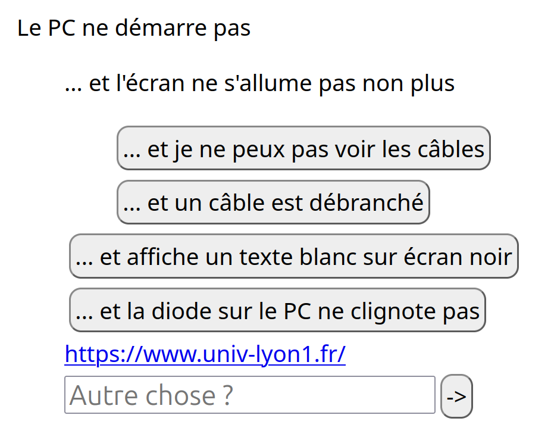

# QRbug Configuration

QRbug uses multiple journal files as config.  
You can find them in the `JOURNALS/` directory.

## Journals
### Default DB
The `default_db.py` is always run first, and defines base users, selectors, and failures.  
It is not meant to be edited by the end user, but rather by the developer of QRbug.

### DB
The `db.py` file contains the end user's QRbug configuration.  
It defines user groups, failures, things, selectors, dispatchers, actions... And parents them so they form a hierarchy.

#### User groups
You can parent a user group to another through the `user_add(parent_id, child_id)` method.  
Doing so will make sure that the child group benefits from the parent group's privileges, with slight modification if wanted.

#### Failures
A failure defines a type of failure that can happen to a piece of equipment.  
It is what will be presented to the user when scanning some equipment's QR code.

You can create/update a failure with the following code :
```py
failure_update(failure_id, value, display_type, ask_confirm, allowed)
```
Each of these parameters *(besides `failure_id`)* is optional if you want to modify a failure.

- **Value** (string) : The written value that will be displayed when presenting the failure.
- **Display type** (DisplayType) : One of 4 available display types when presenting the failure to the user
  - `Text` : Just some text ; `value` will be presented as simple raw text. _This failure type cannot be manually triggered by a user._
  - `Button` : A button the user can click to report an incident ; `value` will be the text inside the button. 
  - `Redirect` : A link to something the user might want to know about ; `value` will be the link itself, e.g. https://example.com. _This failure type cannot be manually triggered by a user._
  - `Input` : A one line input box the user can write into to report an incident ;
  - `Textarea` : A multi-line box the user can write into to report an incident ;
- **Ask confirm** (bool) : Whether to present the user with a confirmation box before submitting the incident report for this failure.
- **Allowed** (Selector) : Report allowed if incident+user matches the selector.

You can parent a failure with `failure_add(parent_id, child_id)`.
Parenting failures allows to create a hierarchy of failures that can be attached to any object, so the users can report exactly what went wrong.

Here is such an example :
```py
selector('ROOT', '{"class": "SourceUser", "test": "in_or_equal", "value": "ROOT"}')
failure_update("PC_NO_BOOT", value="Le PC ne démarre pas", display_type=Text, allowed="ROOT")
failure_update("PC_NO_BOOT_BIOS_ERROR",   value="... et affiche un texte blanc sur écran noir", display_type=Button, ask_confirm=True, allowed="ROOT")
failure_update("PC_NO_BOOT_BLACK_SCREEN", value="... et l'écran ne s'allume pas non plus", display_type=Text, ask_confirm=True, allowed="ROOT")
failure_update("PC_NO_BOOT_NO_POWER",     value="... et la diode sur le PC ne clignote pas", display_type=Button, ask_confirm=True, allowed="ROOT")
failure_update("PC_NO_BOOT_OTHER", value="Autre chose ?", display_type=Input, ask_confirm=True, allowed="ROOT")
failure_update("PC_NO_BOOT_BLACK_SCREEN_UNPLUGGED_WIRE", value="... et un câble est débranché", display_type=Button, ask_confirm=True, allowed="ROOT")
failure_update("PC_NO_BOOT_BLACK_SCREEN_PLUGGED_WIRE", value="... et je ne peux pas voir les câbles", display_type=Button, ask_confirm=True)
failure_update("UNIV_WEBSITE", value="https://www.univ-lyon1.fr/", display_type=Redirect, allowed="ROOT")
failure_add("PC_NO_BOOT", "PC_NO_BOOT_BIOS_ERROR")
failure_add("PC_NO_BOOT", "PC_NO_BOOT_BLACK_SCREEN")
failure_add("PC_NO_BOOT_BLACK_SCREEN", "PC_NO_BOOT_BLACK_SCREEN_PLUGGED_WIRE")
failure_add("PC_NO_BOOT_BLACK_SCREEN", "PC_NO_BOOT_BLACK_SCREEN_UNPLUGGED_WIRE")
failure_add("PC_NO_BOOT", "PC_NO_BOOT_NO_POWER")
failure_add("PC_NO_BOOT", "PC_NO_BOOT_OTHER")
failure_add("PC_NO_BOOT", "UNIV_WEBSITE")
```

And the result :  


You can also remove a parenting link between two failures with `failure_remove(parent_id, child_id)`.

#### Thing
A Thing defines a piece of equipment you want to equip with a QR code generated by QRbug.  
This Thing becomes a part of the equipment monitored by QRbug.

To create/update a thing, you can use the following method : `thing_update(thing_id, comment)`  
Each of these parameters *(besides `thing_id`)* is optional if you want to modify a thing.

- **Location** (string) : Where this Thing is on your grounds. _Example : "Building C, Floor 4, Room 408"_
  - Please note this is simply a hint for the maintenance people repairing the incident, and serves no purpose to QRbug by itself.
- **Failure ID** (FailureID) : The root failure for which failures can be presented for this thing.
  - The children of this failure should represent _how_ this Thing should fail.
- **Comment** (string) : Just a comment about this thing for the maintenance people.

Example :  
```py
thing_update("b710pc0101")
thing_add_failure("b710pc0101", "PC_NO_BOOT")
thing_update("b710pc0101", comment="3ème à gauche")
```
*Please see image above for page where this Thing's QR code brings*

You can also delete a Thing from the QRbug database with `thing_del(thing_id)`.

#### Selectors
A selector is a filter that can be used by Dispatchers (see later) to know which Actions (see later) to trigger based on whether the given incident meets the required conditions for this dispatcher to run.

You can create/update a selector with the following method : `selector(selector_id, expression)`

- **Expression** (string) : A Python expression that evaluates to a boolean (whether the dispatcher can run). The following variables are accessible in this expression :
  - `user` : An instance of the User class. The User who declared this incident belongs to this group.
  - `thing` : An instance of the Thing class. Represents the Thing that the incident happened on.
  - `failure` : An instance of the Failure class. Represents the Failure that was reported in the incident.

#### Action
An Action is a piece of code that runs when a dispatcher (see later) calls it.

Actions are Python scripts in the `ACTIONS/` folder.  

**How to create an action :**
- First, create a Python script in the `ACTIONS/` directory.
- Second, paste the following boilerplate into it :
```py
from typing import Optional

import qrbug

async def run(incidents: List[qrbug.Incident], request: qrbug.Request) -> Optional[str]:
    pass
```
- The `run` function is the entry point of your program, and will be awaited when called.
  - Its `incidents` parameter is the list of incident to process.
  - The `request` parameter corresponds to the aiohttp request the user made to the server to register the incident
- To send HTML back to the webpage displayed after your action is called, use the following code :
```py
await request.write("my_html_string")
```
- To send data back to the program, return #TODO: TO UPDATE

#### Dispatcher
Dispatchers are made to know when to trigger an action based on a selector.

You can create/update one with `dispatcher_update(dispatcher_id, action_id, selector_id, incidents)`.

Each of these parameters _(besides `dispatcher_id`)_ are optional.

- **Action ID** : The ID of the action to trigger when this dispatcher deems it necessary.
- **Selector ID** : The ID of the selector the dispatcher will run to know if the action should be triggered
- **incidents** : The ID of the selector filtering the incident list to pass to the action.

You can delete a dispatcher with `dispatcher_del(dispatcher_id)`.

### Incidents
This file logs incidents occurring, incidents being repaired, and dispatchers being dispatched.  
It is made entirely automatically and should be only read, not edited.
